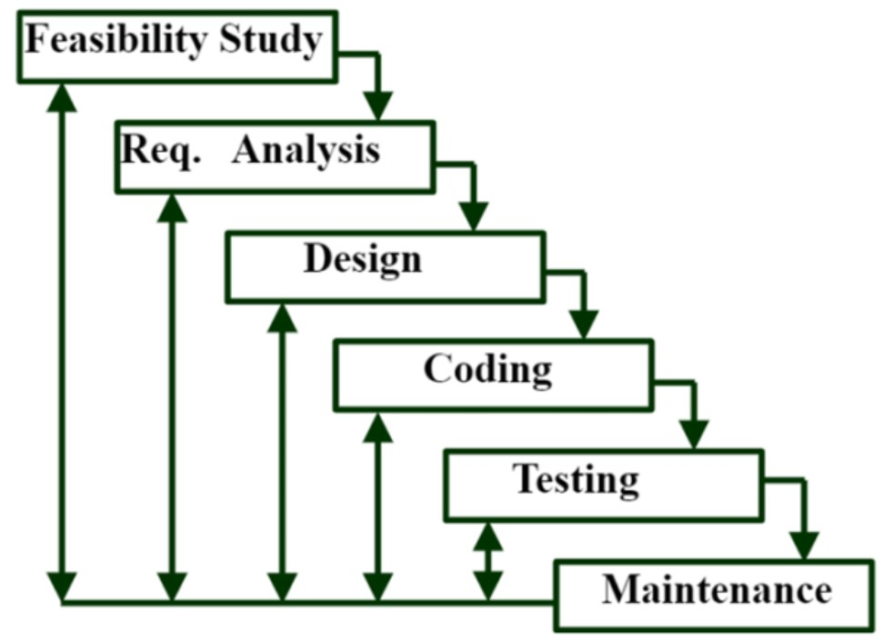
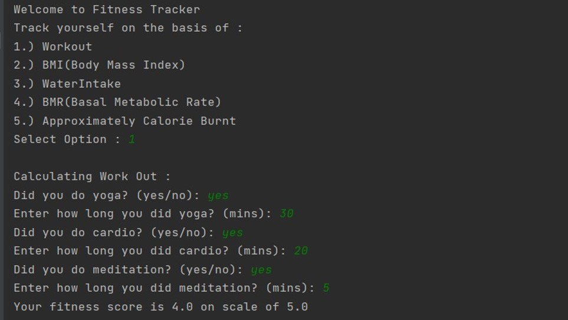
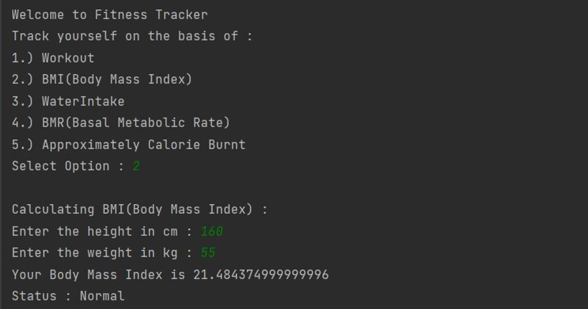
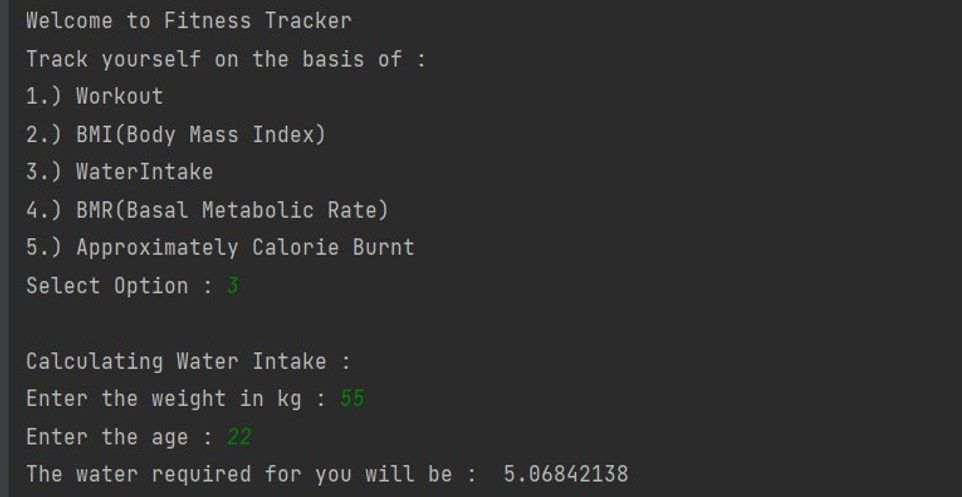
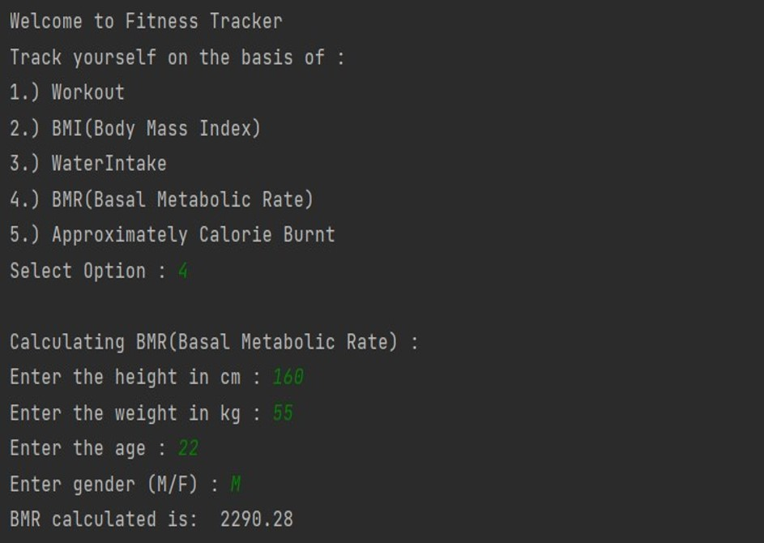
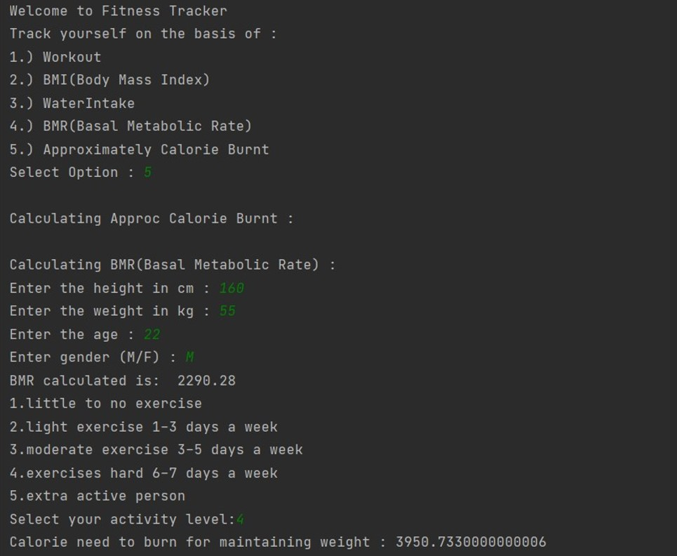
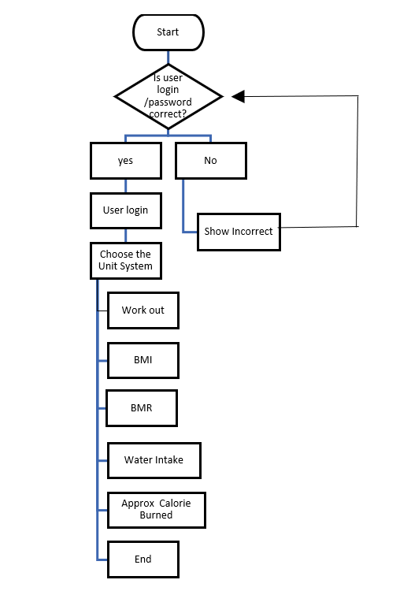
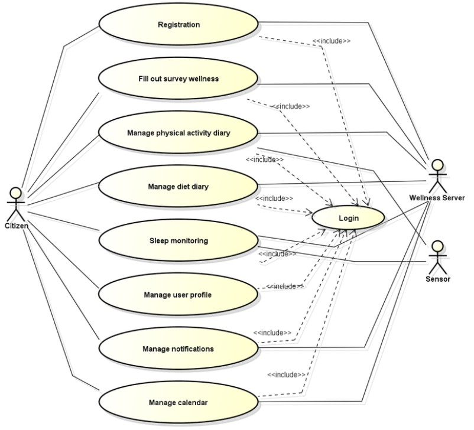
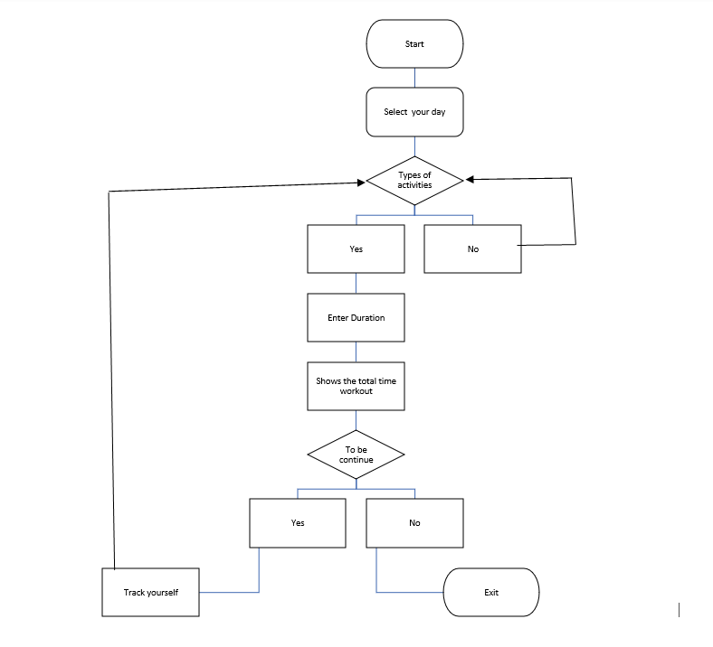
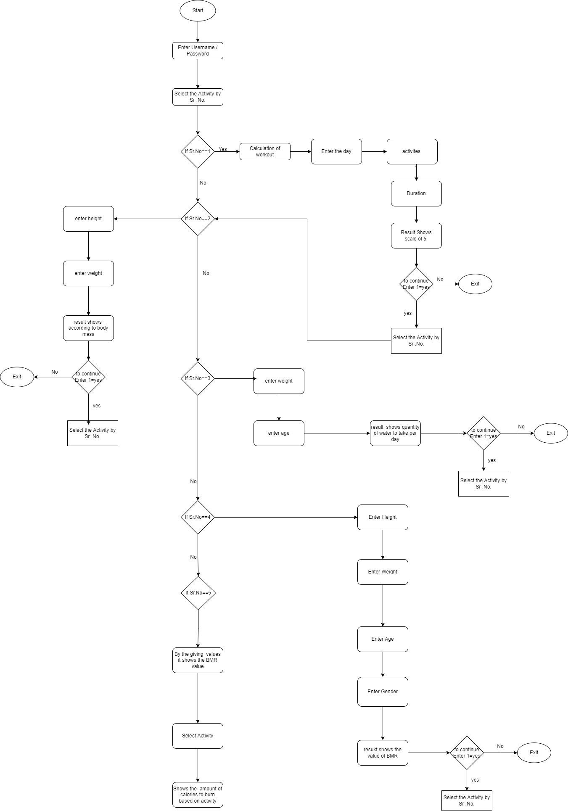

# ✔ FITNESS TRACKER
- ### A "Fitness Tracker" is an application created in python.
- ### It is an application of Software Engineering project, where we used the Iterative WaterFall SDLC Model and developed the complete model.
- ### Here user will be able to track the his/her fitness on the basis of certain inputs that the model will ask.

****

# REQUIREMENTS :
- ### python 3
- ### SDLC Model
- ### Structural and Behavioural diagram

****

# SDLC Model Used :
- ### Iterative Waterfall Model

   

****

# HOW TO Use it :
- ### User just need to download the file, and run the Fitness_tracker.py, on local system.
- ### At start, user will be asked to enter the username and password as login and signup details.
- ### After this user will be given choice to track his/her fitness on the basis of the 5 basic categories, that includes, Daily Workout, BMI(Body Mass Index), Water Intake, BMR(Basal Metabolic Rate) and the approximate calorie burnt.
- ### These above five things related to fitness will be tracked on the basis of user inputs like, daily workout and exercise details, height, weight, gender, etc.

# Purpose :
- ### The basic purpose of this application is to understand the developement of any Software Engineering projects using any kind of Software Developement Lifecycle model. Like here we used Iterative Waterfall Model, in which we implemented the Feasibility Study, Requirements Analysis, Design, Coding and Implementation, Testing and Maintenance, steps in sequenctial way. 

# Compilation Steps :
- ### Git clone the project
- ### After that run Fitness_Tracker.py on local system.
- ### Then the script will start running and user can explore it by tracking his/her fitness on the basis of his input details.

****

# SCREENSHOTS:

   
   
   
   
   

****

# Structural Diagram:

   

****

# Use Case Diagram:

   

****

# Behavioural Diagram:

   
   

